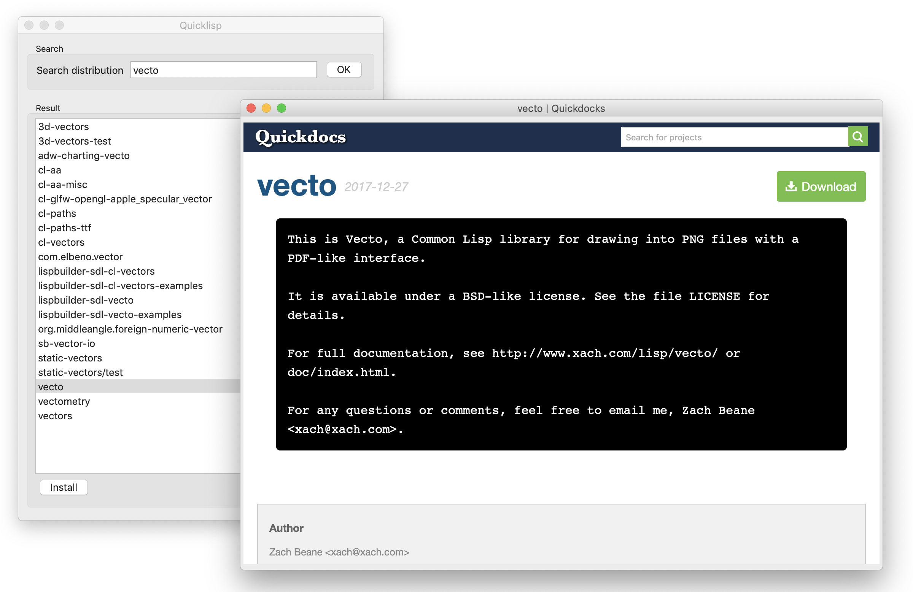

# quicklisp-capi

A quicklisp graphical interface.

It allows you to search and install distributions.

Double clicking on a distribution will open up a browser displaying the
Quickdocs documentation.

*This project is intended as a learning exercise for CAPI. However, feature and
pull requests are more than welcome.*
