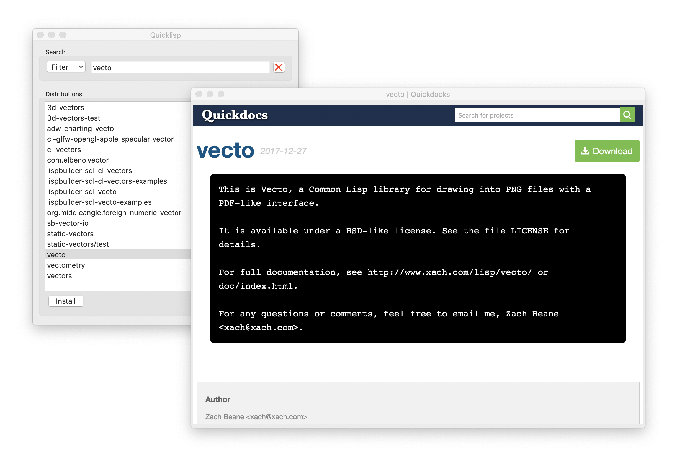

# quicklisp-capi

A quicklisp graphical interface.

It allows you to search and install distributions.

Double clicking on a distribution will open up a browser displaying the
Quickdocs documentation.



*This project is intended as a learning exercise for CAPI. However, feature and
pull requests are more than welcome.*

## Instructions

Make sure to clone this repository where ASDF can see it.

```
CL-USER 1 > (ql:quickload :quicklisp-capi)
To load "quicklisp-capi":
  Load 1 ASDF system:
    quicklisp-capi
; Loading "quicklisp-capi"
[package quicklisp-capi]
(:QUICKLISP-CAPI)

CL-USER 2 > (in-package :quicklisp-capi)
#<The QUICKLISP-CAPI package, 34/64 internal, 0/16 external>

QUICKLISP-CAPI 3 > (main)
#<MAIN-WINDOW "Quicklisp" 421013689B>
```
